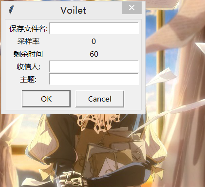

# Violet-Evergarden
人如其名，为他人传递思念之人--薇尔莉特

## 为何会有这个仓库？
In memory of the kind girl Violet.

## 自动手记人偶
何为自动手记人偶？

>自动手记人偶，是奥兰多博士所制造，能将人类的话语记下并书写的机械。当初，此种机械是奥兰多博士为其身为小说家的爱妻所制。时至今日广泛普及于世上，并出现能提供租借人偶的机构。此外，也有一群像人偶一样，从事替人书写工作的代笔者，也被称为“自动手记人偶”。

## 谁是薇尔莉特？


>拥有金发蓝眼的美丽少女。与其美貌不相称的是，拥有罕见的战斗力。幼年时被基尔伯特的兄长利用着，随后转手给基尔伯特。原为莱丁谢夫特里希国的女兵，因其强大的战斗力而受人畏惧，并且不被军中的同袍视为人而是“武器”的存在。后因一场大战失去了双手，离开了军队。在基尔伯特的引荐下成为伊芙加登家族的养女。
一开始是个只听得懂以“杀！”为命令的女孩，之后在与基尔伯特的相处过程中，获得了基尔伯特给予以“紫罗兰（Violet）”为名的名字，并且从他身上学会语言以及文字。在一次外出时，得到了一颗如基尔伯特眼睛颜色般美丽的祖母绿宝石胸针，并时时刻刻带着，当作自己主人的分身在守护着。对于薇尔莉特而言，基尔伯特是个特殊且不可取代的存在。
目前隶属于C·H邮政公司。一开始为邮差的职务，但因想要了解基尔伯特当初对自己所说的“我爱你”为何意而转为担任“自动手记人偶”的工作替他人写信传达思念。因成长的背景，使得薇尔莉特一开始并不懂的战场上以外的事情，但透过一次次的任务与各式各样的人相遇之后，从他人身上逐渐学会人与人之间的相处以及情感，并且懂得“爱”为何物，也开始懂得爱人。

## 现在薇尔莉特应该能做什么？

作为自动手记人偶的义务

- 输入语音并识别，转化为文字
- 发送以文字为内容的邮件到相应的邮箱

## 使用方法

### 设置你的信件代理邮箱
在根目录下新建`config.ini`文件，写入如下内容
```
# -*- coding: utf-8 -*-
[DEFAULT]
HostServer = your_mail_host_server
SenderQQ = your_qq
PWD = your_qq_mailbox_apikey
SenderQQMail = your_qq_mail_address
```
### 运行
- 直接运行`core.py`
- 点击`语音邮件`菜单可以发送语音转文字内容的邮件
- 点击`文字邮件`则需要你手动输入邮件的内容
- 生成的音频应该在`wave/`目录下
- 语音转文字之后的文本在`speech/`目录下
- 爬虫爬取到的love语句在`love/`目录下
- 只需添加你的发信人邮箱和发信主题即可，剩下的薇尔莉特会帮你完成

### 或者

使用命令行版本
输入`python core_cmd.py --help`或者`python core_cmd.py [comand] --help`查看相应的帮助。运行相应的命令请使用`python core_cmd.py [options]`

## TODO
- 全局设置的功能


## 部分效果图

### 主界面


### 语音邮件


### 文字邮件


### 输入内容


### 发送成功


### 大功告成！


### 什么是爱

## 友链
[violet_client](https://github.com/AuthurExcalbern/Violet)
一位小哥的邮件查看violet版本

## 感谢
`Anqurvanillapy`的提醒
